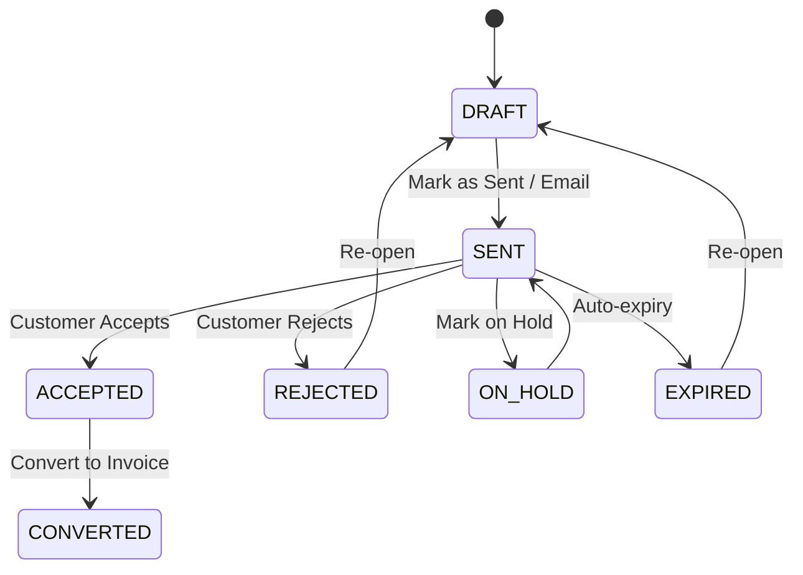

# Quotes Feature Documentation

## Overview

The Quotes feature allows users to create, manage, and track price estimates for customers. It supports a full lifecycle from Draft to Invoiced, including versioning and duplication capabilities.

## Data Model

### Core Entities

- **Quote**: Represents the headers (customer, dates, totals).
  - `status`: Enum (`DRAFT`, `SENT`, `ACCEPTED`, etc.)
  - `versionNumber`: Integer tracking the revision.
  - `parentQuoteId`: Link to the previous version (if applicable).
- **QuoteItem**: Line items associated with a quote.
  - Supports `productId` link or custom description.
  - Includes `colors` (palette) and `attachments` (S3 files).
- **QuoteStatusHistory**: Audit trail of status changes.

### Status Lifecycle

Mermaid diagram of the status flow:

## Workflows

### 1. Creation & Editing

- New quotes start in **DRAFT**.
- Users can add items, select customers, and attach files.
- **Permissions**: `canCreateQuotes` (Manager/Admin).

### 2. Sending

- Quotes can be marked as **SENT** manually or via email.
- Sending locks the quote editing (unless moved back to draft/versioned).

### 3. Versioning

- **Action**: "Create Version".
- **Behavior**: Creates a _child_ quote linked via `parentQuoteId`.
- **Use Case**: Negotiating changes while keeping history.
- The new version starts as **DRAFT**. The old version remains as history.

### 4. Duplication

- **Action**: "Duplicate Quote".
- **Behavior**: Creates an _independent_ copy.
- **Difference from Versioning**: No `parentQuoteId` link. It's a fresh start (e.g., for a similar project).
- **Handling**: Copies items, colors, and notes. Attachments are referenced (safe deletion logic ensures files stick around).

### 5. Conversion

- **Action**: "Convert to Invoice".
- **Behavior**: Creates a draft Invoice based on quote details.
- **Status**: Updates Quote status to **CONVERTED**.

## Permissions

| Role    | View | Create/Edit | Delete | Validation  |
| ------- | ---- | ----------- | ------ | ----------- |
| Admin   | ✅   | ✅          | ✅     | Full Access |
| Manager | ✅   | ✅          | ✅     | Full Access |
| User    | ✅   | ❌          | ❌     | Read-Only   |

## Folder Structure

- `src/features/finances/quotes`: Feature-specific UI and hooks.
  - `/components`: UI components (`QuoteTable`, `QuoteForm`, etc.)
  - `/hooks`: React Query hooks.
- `src/repositories/quote-repository.ts`: Data access layer.
- `src/actions/quotes.ts`: Server Actions entry point.
